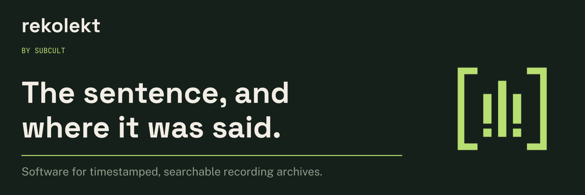

# Rekolekt

Rekolekt is software for running an archive of long recordings. It transcribes
each recording with timestamps, indexes the text, and links every passage back
to the second it was spoken in the source video.

You deploy it yourself; it is not a hosted upload service. It suits people who
maintain a collection and want others to search and cite it: a creator with a
back catalog, a research group, a community keeping its own reference.

[Explore Rekolekt](https://subcult.tv/products/rekolekt) · [See it in use at HasanAra](https://hasanara.tv) · [Suggest a feature](https://git.subcult.tv/subculture-collective/rekolekt/issues)

## What it does

- **Transcript and index:** videos are ingested and transcribed into timestamped
  text that visitors can browse and search.
- **Source link:** results open in the original player, with the surrounding
  transcript alongside.
- **Passage link:** a visitor chooses a start and end, previews the selection, and
  copies a link that restores the range and context. Basic passage links need no
  account.
- **Saves and exports:** visitors can save searches and moments, and export
  transcript text for further work.
- **Brand profile:** each archive supplies its own public profile, artwork, and
  theme while using the same application core.

Transcripts are machine-made and can contain errors; check the recording before
quoting. Passage links point to the currently available source and transcript;
they are not immutable citations or downloaded video clips. See the [passage-sharing guide](docs/product/passage-sharing.md).

## Each archive runs under its own name

[HasanAra](https://hasanara.tv) runs on Rekolekt with its own identity and broadcast
sources. Other archives can supply their own branding without maintaining a
source fork or rebuilding the frontend. Available features depend on the
deployment's server settings.

The repository is now `subculture-collective/rekolekt`; historical deployment
identifiers may still use `transcript-create`.

## Run your own or contribute

For ingestion, deployment configuration, local setup and verification, the
[development guide](DEVELOPMENT.md) covers setup and the canonical `make verify`
gate.

- [Client branding and deployment](docs/deployment/client-branding.md)
- [Testing guide](docs/development/testing.md)
- [API reference](docs/api-reference.md)
- [Documentation index](docs/STATUS.md)

Built by [Subcult](https://subcult.tv). Licensed under [Apache-2.0](LICENSE), with
[third-party notices](docs/THIRD_PARTY_NOTICES.md).
